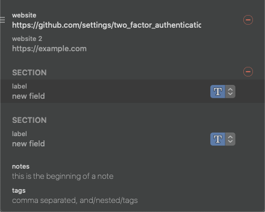
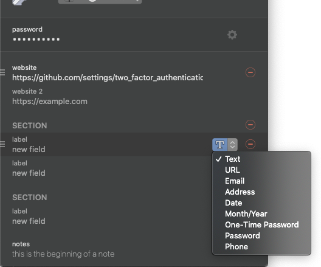

# [InfraSec](../README.md) / One-Time Passwords

One-Time Passwords (aka OTPs or TOPTs) are exactly what they sound like. They are randomly generated passwords that can only be used once. They are often used for two-factor or multi-factor authentication.

## Storing one-time passwords in 1Password

You can store one-time passwords in a number of ways: Authy, Google Authenticator, 1Password, etc. This tutorial will focus on 1Password since this is where Martin's experience stores passwords in the first place.

As I learn best with examples, let's pretend I're setting up 2FA on gitlab. If you want a more general tutorial, follow this [link](https://support.1password.com/one-time-passwords/).

On your gitlab Account, click Settings > Security. You will see a couple of methods for 2FA. In my case, I're interested in setting up 2FA with an authenticator app.

You should be redirected to an intro screen. Click the green button `Set up using an app`.

Download the recovery codes and store them safely away before heading for the next step.

You should now see a QR code. This is where 1Password comes in.

Open the 1Password app on your computer (not the browser extension).

If you already have your gitlab password saved in 1Password, go ahead and edit it.

If you don't, quickly generate a new password and edit it.

Scroll down until you see two fields called `label` and `new field`.

Click the drop-down next to the field and select `One-Time Password`.

The field will then transform.

You see that QR code icon? Click it. This will open a scanner window.

_Note_: This part can be finicky. You might have to save the password and edit again for the scanner window to pop up.)

Your goal is to now to drag the scanner window over the gitlab QR code to scan it.

_Note_: If you use multiple monitors, I recommend putting the scanner window and the browser window where you're configuring gitlab on the same monitor. It also helps to make sure the browser window is not full-sized.

Once scanned, save your edits.

You will now see that there is a six-digit code under your new label. It will have a running timer next to it.

_Note_: These tokens are time-based. Once the timer runs out, the code has expired and a new one will generate.

Type in the code as requested in gitlab.

Press that `Enable` button.

Congrats, you have created a OTP in 1Password for your gitlab account!
